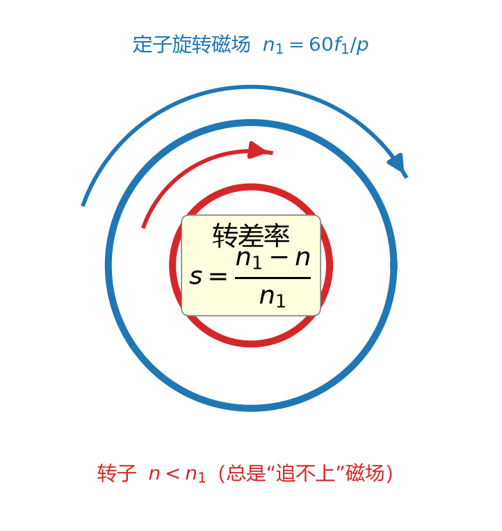
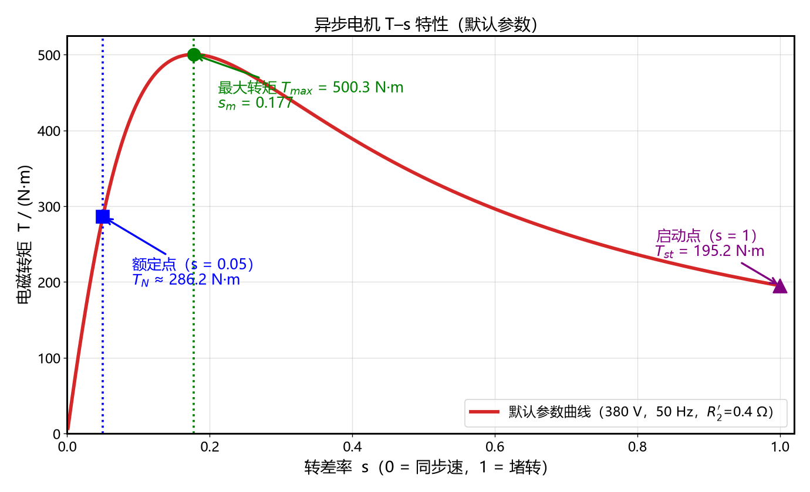

# ELectMotor · 电机学教学演示系列

面向本科《电机学》课堂投屏演示的 Jupyter Notebook 系列。学生无需本地部署，教师投屏或分享网页即可。
本仓库当前为系列**样章（兼模板）**：异步电机 T-s 特性。后续章节将复用本 notebook 的结构与代码风格。

## 章节

| 章节 | Notebook | 内容 |
| --- | --- | --- |
| 样章 | [异步电机T-s特性.ipynb](异步电机T-s特性.ipynb) | 转矩–转差率特性：现象引入 → 公式推导 → 滑块交互实验区 → 思考题 |

## 效果预览（默认参数：380 V，50 Hz，R₂′=0.4 Ω）

转差率物理图像（第一章）：



T–s 特性曲线（第三章，含最大转矩点 / 额定点 / 启动点标注）：



## 运行方式

```bash
pip install -r requirements.txt          # numpy / matplotlib / ipywidgets / voila

jupyter lab                              # Jupyter 交互模式：可编辑、调试
voila 异步电机T-s特性.ipynb               # 课堂投屏演示模式：网页 + 隐藏代码
```

## 说明

- 交互区提供 R₂′（0.1~1.5 Ω）、V₁（200~420 V）、f₁（20~60 Hz）滑块与恒 V/f 切换、重置按钮；
  拖动滑块实时刷新曲线，并叠加默认参数的灰色虚线便于对比。
- **GitHub 网页**只渲染 notebook 中的静态图片输出，交互滑块图需在 Jupyter / Voilà 中运行查看；
  为此 notebook 内专门附了一个「静态预览」cell，浏览网页时也能看到 T-s 曲线形状。
- 全部物理量采用 SI 单位，符号体系参考汤蕴璆《电机学》。
